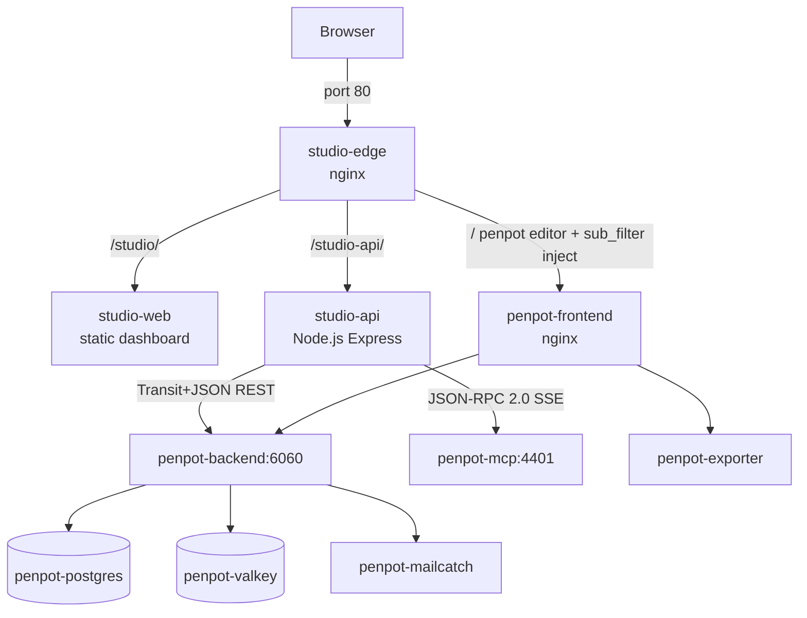

# AI Design Studio

> Self-Hosted AI Design Studio Engine powered by **Penpot** and **Hermes Agent**.


---

## Overview

**Hermes-pot-gen** is a white-labeled, AI-augmented design environment built on [Penpot](https://penpot.app) — fully self-hosted, single-origin, with an AI copilot panel that generates design elements from natural language prompts.

### Key Highlights
- **Single-Origin Edge** — nginx routes studio dashboard, API, and Penpot editor through port 80; no CORS.
- **AI Copilot Panel** — floating panel injected into the Penpot editor; prompt → Plugin API creates boards and text on the active canvas via MCP.
- **Server-side Session Pool** — studio-api holds a Penpot service account session; browser clients never touch service credentials.
- **Transit+JSON Decoder** — pure JS decoder for Penpot's transit array response format, no external deps.
- **White-label Ready** — Penpot branding hidden via injected CSS; page title overridden to "AI Design Studio".

---

## Architecture



**Single-origin design:** all traffic enters through `studio-edge` on port 80. No CORS. Auth cookies work across the editor and API without cross-origin restrictions.

---

## Features

- **Studio Dashboard** — canvas grid with create/open, dark theme, real-time loading states
- **White-label Penpot editor** — Penpot branding hidden via injected CSS; page title overridden to "AI Design Studio"
- **AI Copilot Panel** — floating panel inside the Penpot editor, submit a prompt → SSE streaming status → Plugin API creates a board + text on the active canvas
- **Server-side session pool** — `studio-api` authenticates as a service account; browser clients never see the service credentials
- **Transit+JSON decoder** — pure JS decoder for Penpot's transit array format, no external dependency
- **MCP relay** — `studio-api` initializes an MCP session and relays `execute_code` calls to the Plugin API running in the editor browser tab

---

## Quick Start

```bash
# 1. Clone
git clone https://github.com/<your-org>/Hermes-pot-gen.git
cd Hermes-pot-gen

# 2. Configure
cp .env.example .env
# Edit .env — at minimum set PENPOT_PUBLIC_URI if not using 100.106.40.93

# 3. Build and start everything
docker compose up --build -d

# 4. Open the studio dashboard
open http://localhost/studio/

# 5. Open Penpot editor directly (bypasses studio-edge)
open http://localhost:9001
```

---

## Service Ports

| Port | Service | Description |
|------|---------|-------------|
| **80** | `studio-edge` (nginx) | Studio dashboard, API proxy, white-labeled Penpot editor |
| **9001** | `penpot-frontend` | Penpot editor direct access (no white-label injection) |
| **4401** | `penpot-mcp` | MCP server (JSON-RPC 2.0, used by studio-api internally) |
| **1080** | `penpot-mailcatch` | Mailcatcher webmail (dev only) |

Internal-only (Docker network `penpot`):

| Port | Service |
|------|---------|
| 4000 | `studio-api` |
| 3000 | `studio-web` |
| 6060 | `penpot-backend` |
| 5432 | `penpot-postgres` |

---

## Environment Variables

| Variable | Default | Description |
|---|---|---|
| `PENPOT_PUBLIC_URI` | `http://100.106.40.93:9001` | Public URL of Penpot (used by frontend/backend) |
| `PENPOT_VERSION` | `2.18` | Penpot image tag |
| `PENPOT_SERVICE_USER` | `studio-service@nct.internal` | Service account email for studio-api |
| `PENPOT_SERVICE_PASS` | `StudioSecretPassword123!` | Service account password |
| `PENPOT_DEFAULT_PROJECT_ID` | `5e8f6953-...` | Project where studio creates canvas files |

---

## How the AI Copilot Works

1. User types a prompt in the copilot panel (injected by `inject.js`)
2. Browser POSTs to `/studio-api/api/chat` (proxied by nginx)
3. `studio-api` opens an SSE stream, initializes an MCP session with `penpot-mcp`
4. Sends `tools/call` → `execute_code` with Plugin API JS that creates a board + headline text
5. SSE events stream back: `status` → `status` → `result`
6. Copilot panel renders each event as a message bubble

---

## Security Notes

- Service account credentials stored in `.env` (not committed — see `.gitignore`)
- `auth-token` cookie is HttpOnly; service session never exposed to browser JS
- `/internal/auth` nginx location is marked `internal` — not reachable from outside
- All inter-service traffic stays on the Docker `penpot` network
- No credentials are hardcoded in built images; all via environment variables
- **Production:** rotate `PENPOT_SECRET_KEY`, use a secrets manager for `PENPOT_SERVICE_PASS`, add `limit_req_zone` to nginx for `/studio-api/api/chat`

---

## Project Structure

```
Hermes-pot-gen/
├── apps/
│   ├── studio-api/          # Node.js Express API (Transit decode, session, MCP relay)
│   │   ├── Dockerfile
│   │   ├── package.json
│   │   └── src/index.js
│   └── studio-web/          # Static web server (dashboard + white-label assets)
│       ├── Dockerfile
│       ├── package.json
│       ├── server.js
│       └── public/studio/
│           ├── index.html   # Dashboard SPA
│           ├── inject.js    # Runtime injected into Penpot HTML pages
│           └── whitelabel.css
├── infrastructure/
│   └── nginx/
│       └── studio.conf      # Nginx edge routing config
├── docs/
│   ├── BLUEPRINT.md
│   ├── STANDALONE_AI_DESIGN_STUDIO_PLAN.md
│   └── IMPLEMENTATION_AUDIT.md
├── docker-compose.yaml      # Full stack (Penpot + Studio services)
├── .env.example
└── README.md
```

---

## Roadmap

- [x] Penpot self-hosted stack with MCP and Plugin API enabled
- [x] Service account pre-registered in Penpot Postgres
- [x] MCP endpoint verified working (initialize + execute_code)
- [x] Transit+JSON decoder (pure JS, no deps)
- [x] Server-side session pool with auto-refresh
- [x] Canvas CRUD API (list, create via Penpot file API)
- [x] Studio dashboard UI (dark theme, canvas grid, create modal)
- [x] White-label CSS (hide Penpot branding)
- [x] AI Copilot panel (injected into editor, SSE streaming)
- [x] Single-origin nginx edge (sub_filter injection, SSE proxy)
- [ ] MCP warm browser tab via Playwright (for headless execute_code)
- [ ] AI prompt → structured layout (multi-frame, layer hierarchy)
- [ ] Canvas version history / named snapshots
- [ ] Studio user auth (separate from Penpot user accounts)
- [ ] Redis-backed session pool (HA multi-instance studio-api)
- [ ] Rate limiting on chat endpoint

---

## Documentation

See [docs/BLUEPRINT.md](docs/BLUEPRINT.md) for original architecture and engineering specifications.  
See [docs/IMPLEMENTATION_AUDIT.md](docs/IMPLEMENTATION_AUDIT.md) for API verification, Transit decode strategy, and auth design.
